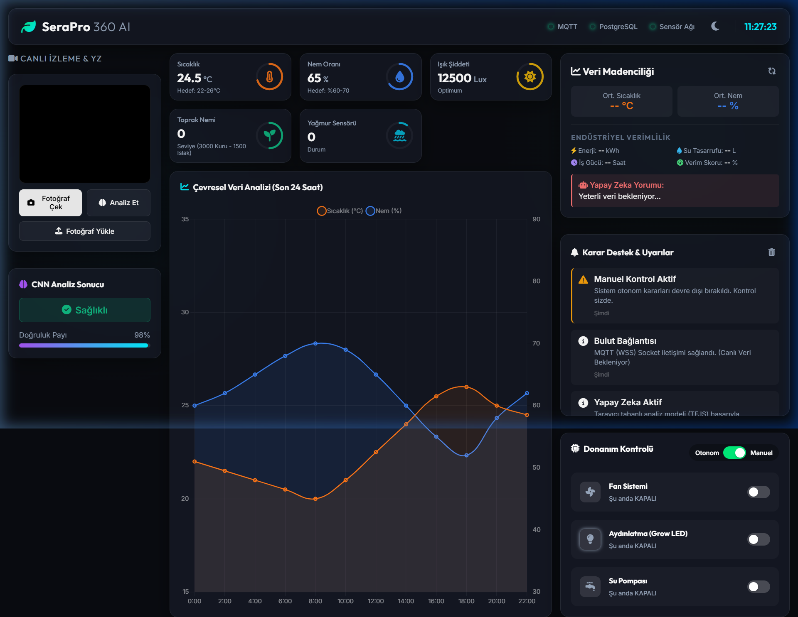
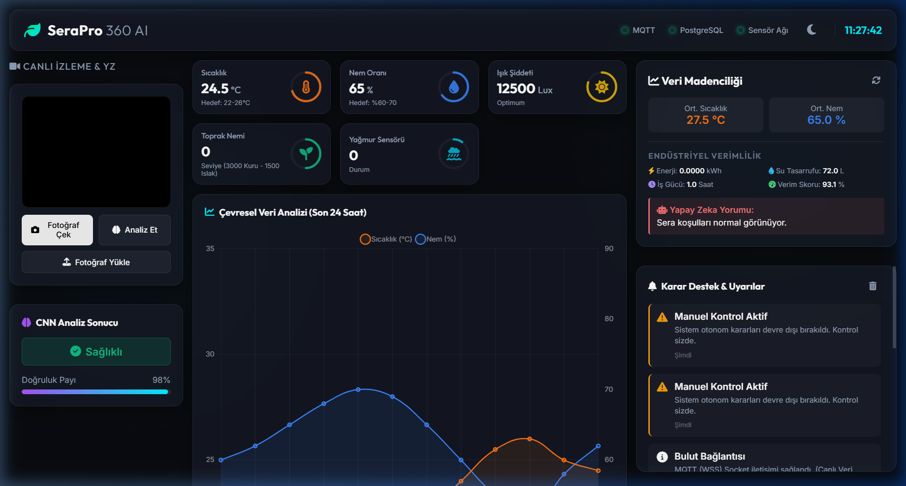
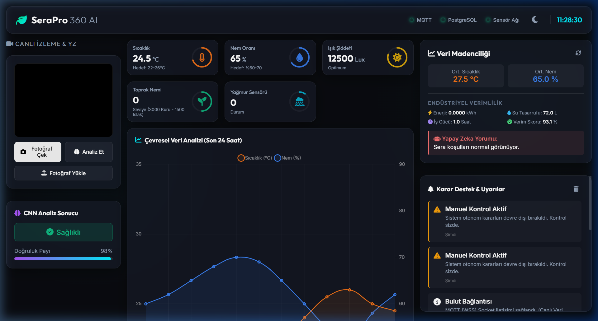
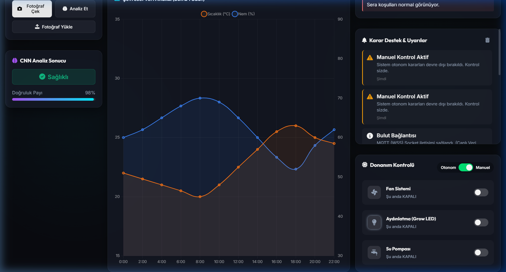

# 🌱 SeraPro 360 AI: Next-Gen Autonomous Greenhouse System

[](#)
[](#)
[](#)
[](#)

**SeraPro 360 AI**, modern tarım teknolojilerini (AgTech) yapay zeka ve IoT ile birleştiren, tam otonom bir akıllı sera yönetim platformudur. Bu proje, bitki sağlığını gerçek zamanlı olarak izlemek, hastalıkları tespit etmek ve çevresel koşulları otonom olarak optimize etmek için tasarlanmıştır.

---

## 📸 Visual Showcase

### 🖥️ Dashboard Overview
Modern Glassmorphism tasarımı ile tüm sensör verileri ve kontrol mekanizmaları tek bir ekranda.


### 🧠 AI Disease Detection & Analysis
ESP32-CAM üzerinden gelen görüntüler, tarayıcı tabanlı CNN modeli ile analiz edilerek hastalık tespiti yapılır.


### 📊 Real-time Monitoring & Data Mining
Sensör ağı üzerinden gelen veriler anlık olarak işlenir ve endüstriyel verimlilik skorları hesaplanır.



### ⚙️ Hardware Control
Otonom ve Manuel mod seçenekleri ile fan, pompa ve aydınlatma sistemlerinin tam kontrolü.


---

## 🛠️ Tech Stack

### 💾 Backend & Cloud
- **Node.js & Express**: API yönetimi ve iş mantığı.
- **Supabase (PostgreSQL)**: Veri depolama ve loglama.
- **MQTT (HiveMQ Cloud)**: Donanım ile gerçek zamanlı, düşük gecikmeli haberleşme.
- **Render**: Bulut tabanlı sunucu dağıtımı.

### 🎨 Frontend
- **Vanilla JavaScript & CSS3**: Modern, hızlı ve bağımlılıksız kullanıcı arayüzü.
- **Glassmorphism Design**: Estetik ve kullanıcı dostu görsel dil.
- **Chart.js**: Çevresel verilerin grafiksel analizi.
- **TensorFlow.js**: İstemci tarafında çalışan derin öğrenme modeli.

### 🤖 Artificial Intelligence (AI)
- **Random Forest Classifier**: Sensör verilerine dayanarak otonom karar verme (Fan/Pompa/LED yönetimi).
- **CNN (Convolutional Neural Networks)**: Görüntü işleme ile domates hastalıkları (Early Blight, Late Blight vb.) tespiti.

### 🔌 Hardware
- **ESP32 DevKit V1**: Ana kontrol birimi.
- **ESP32-CAM**: Canlı görüntü akışı ve AI analizi için görsel veri kaynağı.
- **Sensors**: DHT22 (Sıcaklık/Nem), LDR (Işık), Toprak Nemi Sensörü, Yağmur Sensörü.
- **Actuators**: Röle kontrollü Su Pompası, Grow LED ve Fan Sistemi.
- **OLED Display (SSD1306)**: Cihaz üzerinde anlık veri gösterimi.

---

## 🏗️ System Architecture

1.  **Veri Toplama**: ESP32 sensörlerden verileri toplar ve OLED ekranda gösterir.
2.  **Haberleşme**: Veriler MQTT (HiveMQ) üzerinden Backend'e ve Web arayüzüne iletilir.
3.  **Karar Mekanizması**:
    -   **Otonom Mod**: Python ile eğitilmiş Random Forest modeli, sensör verilerine göre cihazları yönetir.
    -   **Görüntü Analizi**: ESP32-CAM görüntüsü TensorFlow.js ile taranır ve hastalık analizi yapılır.
4.  **Depolama**: Tüm geçmiş veriler ve AI analiz sonuçları Supabase üzerinde saklanır.

---

## 🚀 Installation & Usage

### 1. Prerequisites
- Node.js (v18+)
- Python 3.9+
- Arduino IDE (ESP32 Board Manager yüklü)

### 2. Backend Setup
```bash
cd backend
npm install
# .env dosyasını oluşturun ve SUPABASE_URL, SUPABASE_KEY, MQTT_URL bilgilerini girin
npm start
```

### 3. AI Model Training (Optional)
```bash
cd ai
pip install -r requirements.txt
python train_model.py
```

### 4. Hardware Upload
- `esp32_code/esp32_code.ino` dosyasını Arduino IDE ile açın.
- Wi-Fi ve MQTT bilgilerini güncelleyin.
- ESP32 kartınıza yükleyin.

### 5. Frontend
`dist/index.html` dosyasını tarayıcınızda açın veya backend üzerinden sunun (http://localhost:3000).

---

## 🔗 Connect with me on LinkedIn

Bu proje, IoT, AI ve modern web teknolojilerinin birleştiği bir mühendislik çalışmasıdır. Görüş ve önerileriniz için benimle iletişime geçebilirsiniz!

---

**Developed with ❤️ for a Smarter Future.**
